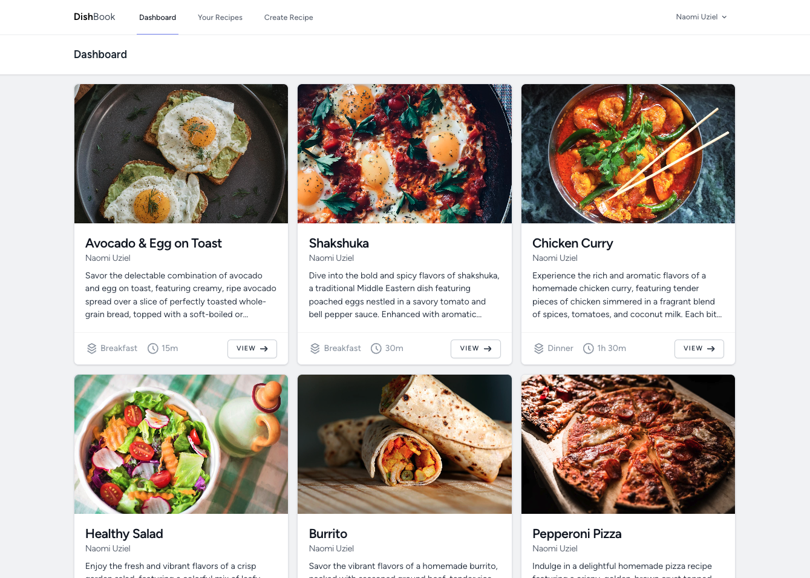
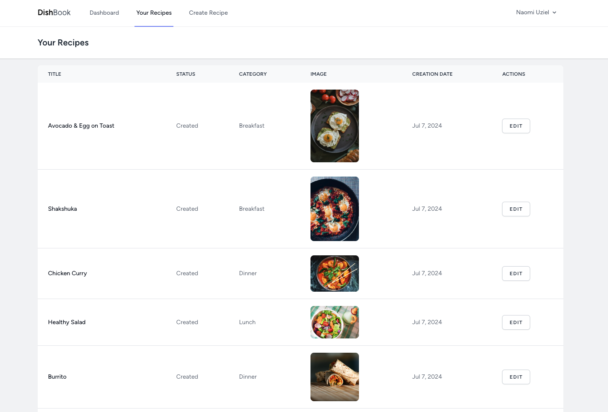
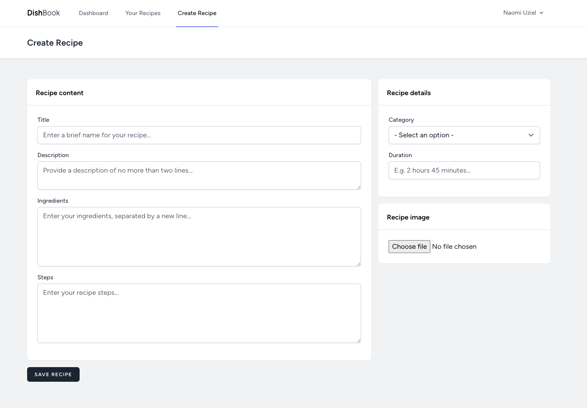

# DishBook

DishBook is a work-in-progress recipe sharing platform built with Laravel. Designed for culinary enthusiasts, this platform aims to provide a space where users can share their favorite recipes and discover new ones. DishBook is still under development, with many exciting features planned for future releases.

## Screenshots

### Homepage

### Recipe management: list

### Recipe management: create/edit

## Current features

-   User-submitted recipes: users can submit and edit their own recipes to share with the community.
-   Category assignment: recipes can be assigned into categories for filtering at a later date.
-   Curated homepage: displaying a list of all user-submitted recipes.

## Planned features

-   Admin dashboard: to allow administrators to manage various aspects of the platform including users, recipes, categories, tags, etc.
-   Approval flow for recipes: force recipes for new users to be approved by an administrator before they are added to the homepage feed.
-   Reviews and ratings: users will be able to leave reviews and ratings on recipes to help others find the best dishes.
-   Comments section: a commenting feature will enable users to discuss recipes, share tips, and connect with other cooking enthusiasts.
-   User profiles: personalized profiles where users can showcase their submitted recipes, favorite dishes, and more.
-   Search and filter: advanced search and filtering options to help users find recipes that match their preferences.
-   Following other users: users will be able to follow their favorite chefs and cooking enthusiasts to stay updated on their latest recipes and activities.

## Getting started

To get started with DishBook, follow these steps:

-   Clone the repository: `git clone git@github.com:naomiuziel/DishBook.git`
-   Navigate to the project directory: `cd dishbook`
-   Install dependencies: `composer install`
-   Set up environment variables: `cp .env.example .env` and configure your `.env` file
-   Generate an application key: `php artisan key:generate`
-   Run migrations: `php artisan migrate`
-   Start NPM process: `npm run dev`
-   Start the development server: `php artisan serve`
